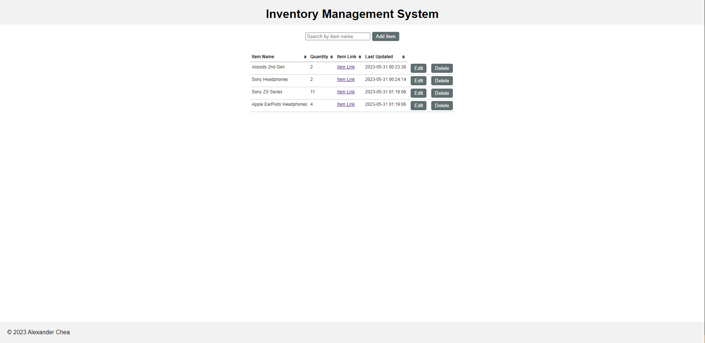

# Inventory-Management-System
- This application allows view, create, update, and delete items to a database
- Items updated to the database will be kept track of with timestamps upon update
- This application has a search/filter function with tablesorter for ease of access to specified items

## Techs
- Project developed using XAMPP
- Apache 2.4.56, MariaDB 10.4.28, PHP 8.2.4, phpMyAdmin 5.2.1, XAMPP Control Panel 3.2.4

